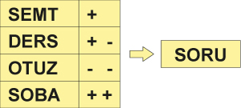

# Gri Ceviz Akıl Oyunlarının Kodlama ile Genel Çözümleri

Burada [Akıl oyunları](https://akiloyunlari.griceviz.com/questions) sitesindeki bulmacalardan bazılarının `picat` programlama dili ile genel çözümlerini kodlamayı deneyeceğim. Picat programını [buradan](http://picat-lang.org/) indirip, belirtilen dosyayı `cl('DOSYA_ADI).` ile yükleyip `main.` ile çalıştırabilirsiniz.

## Sözcük Tahmini
> Dört farklı harften oluşan bir sözcüğü bulmak için tablodaki tahminler yapılmıştır. Tahminlerin yanındaki her “+” işareti, doğru yerde bulunan bir harfe, her “-“ işareti ise yanlış yerde bulunan bir harfe karşılık gelmektedir. Bu bilgileri kullanarak sözcüğü bulunuz.
> Örnek : .

`sozcuk_tahmini.pi` dosyasında 4 harfli kelimeler için genel çözüm bulunmaktadır. Yürütmek için için aynı dizinde `picat`'ı çalıştırıp, sonra`cl('sozcuk_tahmini').` ile dosyayı yükleyip `main.` ile ana fonksiyonu çalıştırabilirsiniz:
```
$ picat
Picat 3.0#4, (C) picat-lang.org, 2013-2020.
Type 'help' for help.
Picat> cl('sozcuk_tahmini').
Compiling:: sozcuk_tahmini.pi
sozcuk_tahmini.pi compiled in 9 milliseconds
loading...

yes

Picat> main.
cevap => SORU

cevap => POSA


yes

```

İstenilen başka bir bulmacayı için `main` fonksiyonuna `cozum[["KELIME1", +SAYISI, -SAYISI], ["KELIME2", +SAYISI, -SAYISI] ... ]` şeklinde ekleyebilirsiniz.
